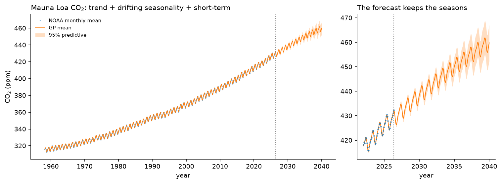
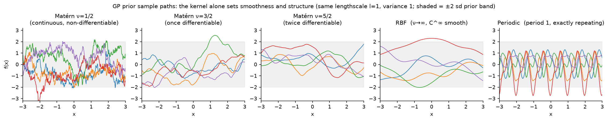
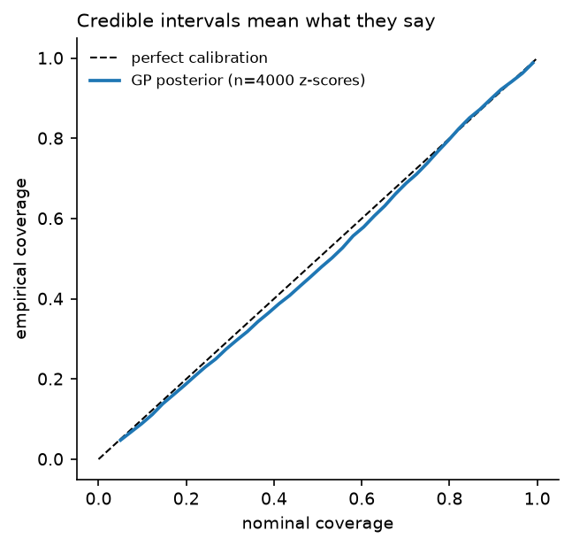
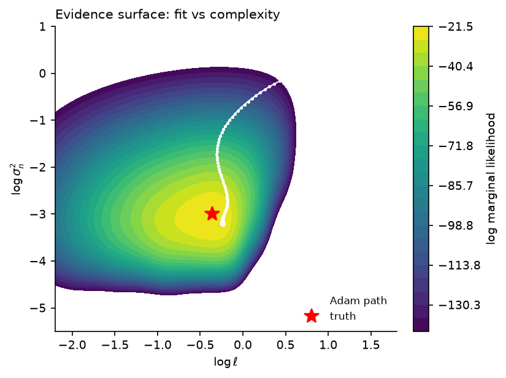
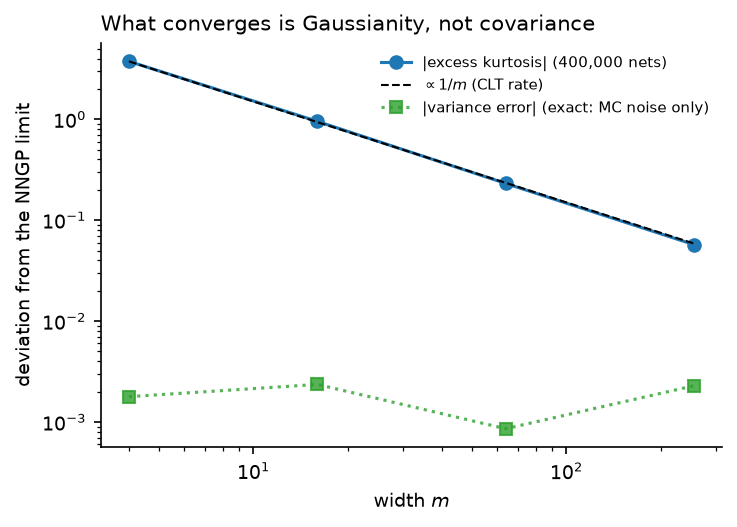
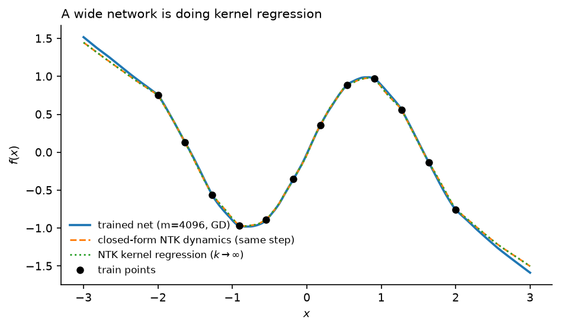

# gp-from-scratch


Gaussian process regression in pure NumPy — no GPy, no GPflow, no
scikit-learn in the library itself — with **every hand-derived gradient
checked against finite differences** and **every posterior cross-checked
against scikit-learn** in the tests. Kernels with analytic log-space
gradients, marginal-likelihood optimization, calibration analysis, and a
real-data forecast (Mauna Loa CO₂) — plus the neural-tangent-kernel
correspondence: a from-scratch wide ReLU network converging to its analytic
GP limit as width grows.



*Mauna Loa CO₂, 819 monthly means (1958–2026), fit with a hand-composed
kernel — RBF trend + (Periodic × RBF) drifting seasonality + Matérn-3/2
short-term — whose nine free hyperparameters are set by maximizing the
evidence. The seasonal period is frozen at exactly 1 year (known physics; it
also removes a gradient instability). The forecast to 2040 keeps the seasons
because the kernel says the correlation is exactly periodic.*

## Problem

A Gaussian process places a prior directly on functions: any finite set of
values $f(X)$ is jointly Gaussian with covariance $K_{ij} = k(x_i, x_j)$.
With Gaussian observation noise, the posterior is Gaussian in closed form —
no MCMC, no variational bound — so regression, uncertainty, and model
selection all reduce to linear algebra. This repo implements that linear
algebra from scratch, the kernels and their gradients by hand, and then
follows the same math out to its large-width neural-network limit.

Everything rests on one identity — $(f(X_*), y)$ is jointly Gaussian — and
Gaussian conditioning via the Schur complement (derived in
[`theory/derivations.md`](theory/derivations.md), Sec. 1):

$$\mu_* = K_*^\top (K + \sigma^2 I)^{-1} y, \qquad \Sigma_* = K_{**} - K_*^\top (K + \sigma^2 I)^{-1} K_*.$$

The inverse is never formed. With $L = \operatorname{chol}(K + \sigma^2 I)$,
predictions are two triangular solves and the log-determinant is
$2\sum_i \log L_{ii}$ — free from the same factorization that gives the mean.
Hyperparameters come from **type-II maximum likelihood** (empirical Bayes):
maximize the log evidence

$$\log p(y \mid \theta) = -\tfrac12 y^\top \alpha - \sum_i \log L_{ii} - \tfrac{n}{2}\log 2\pi,$$

whose three terms are data fit, an Occam complexity penalty, and a constant.
Its gradient is the trace identity

$$\frac{\partial}{\partial\theta_j}\log p(y\mid\theta) = \tfrac12\operatorname{tr}\!\big[(\alpha\alpha^\top - K^{-1})\,\partial_{\theta_j}K\big],$$

derived in Sec. 2 and checked against central differences in the tests.

## What's implemented

| Module | Contents |
|---|---|
| [`gp/gp.py`](gp/gp.py) | Exact GP regression via Cholesky; posterior mean/variance; log marginal likelihood **and** its analytic gradient (trace identity); never forms $K^{-1}$ for prediction |
| [`gp/kernels.py`](gp/kernels.py) | RBF, Matérn (½, 3⁄2, 5⁄2), Periodic — each with analytic gradients in **log-parameter space** — plus `Sum`/`Product` composition and a **frozen-hyperparameter mask** (freeze e.g. a known period; `theta`/`grads`/`n_params` all honor it) |
| [`gp/optimize.py`](gp/optimize.py) | Adam on the (negative) log evidence, with a callback for path logging |
| [`gp/nn.py`](gp/nn.py) | A finite-width one-hidden-layer ReLU network with **hand-written backprop** — the empirical object the NTK theory predicts |
| [`gp/ntk.py`](gp/ntk.py) | Arc-cosine kernels $\kappa_0,\kappa_1$ (Cho & Saul 2009), the NNGP and NTK of that network, and the **closed-form linearized-GD trajectory** as a geometric series |

The library depends on NumPy alone. scikit-learn appears only as an
**independent oracle** — in the test suite and in the parity benchmark
(§4) — never inside the library, to cross-check posterior means, variances,
and marginal likelihoods against.

### Kernels set the prior

Before any data is seen, a GP *is* its kernel. Drawing sample paths from the
zero-mean prior — Cholesky-factor $K = k(X,X)$ and map standard normals,
$Lz \sim \mathcal N(0, K)$ (`gp.gp.sample_prior`) — shows what each kernel
assumes about the unknown function. Same lengthscale and variance throughout,
so only the kernel *family* changes:



The Matérn family is a smoothness dial: $\nu=\tfrac12$ gives continuous but
nowhere-differentiable paths (Ornstein–Uhlenbeck), $\nu=\tfrac32$ once-
differentiable, $\nu=\tfrac52$ twice-differentiable, and the RBF (the
$\nu\to\infty$ limit) infinitely smooth. The Periodic kernel's draws repeat
exactly — the same construction that lets the CO₂ model above extrapolate a
seasonal cycle. Derivations of the smoothness ladder are in
[`theory/derivations.md`](theory/derivations.md) §5.

## Results

### 1. Is the uncertainty real? (`experiments/validate.py`)

Three checks with known answers.

**Calibration across all levels.** On 40 functions drawn from a known Matérn
prior, the posterior z-scores on held-out latents should be standard normal —
so nominal $q$% intervals should cover $q$% of points, *for every* $q$, not
just 95%. They do; the reliability curve tracks the diagonal.

| nominal | 95% |
|---|---|
| empirical coverage | **0.948** |

**Hyperparameter recovery.** Data generated from known
$(\sigma_f^2,\ell,\sigma_n^2) = (2.0,\ 0.8,\ 0.05)$; ML-II from a generic init
over 8 replicate datasets recovers them:

| parameter | truth | median estimate |
|---|---|---|
| $\sigma_f^2$ | 2.0 | 2.10 |
| $\ell$ | 0.8 | 0.82 |
| $\sigma_n^2$ | 0.05 | 0.05 |

<p align="center"></p>

*Left: credible intervals mean what they say. Right: the evidence surface over
$(\log\ell, \log\sigma_n^2)$ with the Adam path climbing to the truth — the
fit-vs-complexity tradeoff made visible.*

### 2. Real data: Mauna Loa CO₂ (`experiments/co2.py`)

The classic GP demonstration (Rasmussen & Williams 2006, §5.4.3): the kernel
is *read off the physics* — a smooth rising trend, an annual cycle whose shape
drifts slowly, and short-term correlated weather — because independent
additive processes add their kernels:

$$k = \underbrace{\text{RBF}}_{\text{trend}} + \underbrace{\text{Periodic}\times\text{RBF}}_{\text{drifting season}} + \underbrace{\text{Matérn-}3/2}_{\text{short-term}} \;(+\ \sigma^2).$$

The seasonal **period is frozen at exactly 1 year** — known physics, and a
numerical necessity: near a phase mismatch the periodic log-period gradient is
$\sim\!10^3$ at init, which destabilized Adam and made an earlier free-period
run diverge and fall back to its initialization. With the period pinned, the
remaining nine hyperparameters optimize smoothly at `lr=0.01` over 800 steps,
and the evidence improves monotonically:

| | LML (init) | LML (best) | improvement |
|---|---|---|---|
| ML-II, 9 free params | −177.2 | −170.9 | **+6.3 nats** (monotonic) |

**Honest out-of-sample evaluation.** Fit on data before 2015, forecast the
held-out 2015–2026 months (11.4 years the model never sees):

| model | held-out RMSE | 95% coverage | trend $\ell$ |
|---|---|---|---|
| hand-set init (no optimization) | **2.46 ppm** | 0.97 | 40 yr |
| ML-II evidence optimum | 8.05 ppm | 0.09 | 21 yr |

The result worth reporting is the one that *isn't* clean: **ML-II raises the
in-sample evidence but extrapolates worse here.** It prefers a shorter trend
lengthscale (21 vs 40 yr) that captures in-sample wiggle; an RBF trend
mean-reverts beyond its lengthscale, so the shorter one undershoots the
continued rise over a decade. ML-II maximizes evidence, not multi-year
forecast skill, and an RBF is a poor prior for an unbounded trend. The
standard R&W remedy — a RationalQuadratic medium-term component — is on the
kernel roadmap. Reported as measured, not tuned to the held-out set.

### 3. Wide networks *are* Gaussian processes (`experiments/ntk_experiments.py`)

The same GP math predicts the behavior of a neural network. For a
one-hidden-layer ReLU net $f(x) = \sqrt{2/m}\,a^\top\mathrm{relu}(Wx)$, two
infinite-width limits have closed forms built from the arc-cosine kernels
(Sec. 6–7): the outputs at initialization are a GP with covariance
$\mathrm{NNGP} = 2\kappa_1$, and training dynamics are governed by the
$\mathrm{NTK} = 2\kappa_1 + 2\kappa_0\,(x{\cdot}x')$.

**Outputs Gaussianize as width grows.** The finite net's output distribution
approaches the NNGP — its *variance* matches at any width (to $\le0.3\%$
here), but *Gaussianity* only arrives at rate $1/m$, visible as excess
kurtosis decaying:

| width $m$ | 4 | 16 | 64 | 256 |
|---|---|---|---|---|
| \|excess kurtosis\| | 3.75 | 0.95 | 0.23 | **0.057** |
| \|var − NNGP\|/NNGP | 0.0018 | 0.0024 | 0.0009 | 0.0023 |

**Trained-network predictions converge to closed-form kernel regression.** The
max gap between the actual net's GD trajectory and the linearized (NTK)
prediction shrinks with width:

| width $m$ | 64 | 256 | 1024 | 4096 |
|---|---|---|---|---|
| max \|net − linearized\| | 0.386 | 0.271 | 0.114 | **0.069** |

<p align="center"></p>

*Left: the output histogram tightening to the Gaussian NNGP as $m$ grows.
Right: a trained finite net (dots) tracking its analytic NTK-regression limit
(line).*

### 4. Parity and speed vs scikit-learn (`experiments/sklearn_parity.py`)

Fitting the *same* kernel at the *same* fixed hyperparameters, our NumPy
implementation reproduces scikit-learn's exact-GP posterior to floating-point
parity, at a small constant-factor time cost (both are $O(n^3)$; the ratio is
implementation overhead, not worse asymptotics):

| $n$ | max&#124;Δmean&#124; | max&#124;Δstd&#124; | ours (ms) | scikit-learn (ms) | ratio |
|---|---|---|---|---|---|
| 100 | 1.7e-10 | 1.6e-10 | 0.5 | 0.5 | 1.1× |
| 400 | 4.2e-11 | 1.2e-10 | 3.4 | 1.9 | 1.8× |
| 800 | 6.7e-11 | 7.8e-11 | 16.8 | 9.5 | 1.8× |

The point is the left two columns: the from-scratch math is correct to ~1e-10,
and the ~1.8× overhead is the honest price of readable NumPy over a tuned
library (timings: single core, best of 3).

## Reproduce

```bash
python -m venv .venv && source .venv/bin/activate
pip install -e ".[dev]"
pytest                          # 35 tests; RuntimeWarnings are errors
cd experiments
python prior_samples.py         # ~2 s  (kernel prior gallery)
python validate.py              # ~20 s
python co2.py                   # ~2 min (ML-II on n~700, 9 free params, twice)
python ntk_experiments.py       # ~30 s
python sklearn_parity.py        # ~2 s  (parity + speed vs scikit-learn)
```

Figures land in `figures/`; every table above is printed by the scripts.
Seeds are fixed.

## Design notes

- **Tests assert theory, not just plumbing.** Every kernel gradient is checked
  against central differences; posterior mean, variance, and log marginal
  likelihood are cross-checked against scikit-learn's `GaussianProcessRegressor`
  on shared data; kernels are verified PSD; the frozen-parameter mask is tested
  to zero exactly the right gradient entries.
- **The inverse is never formed for prediction.** One Cholesky gives the mean
  (two triangular solves), the pointwise variance (a solve against $K_*$), and
  the log-determinant (a diagonal sum) at once. $K^{-1}$ is materialized only
  inside the LML gradient, where the trace identity genuinely needs it.
- **Gradients live in log space.** All positive hyperparameters are
  parameterized by their logs, so optimization is unconstrained and the chain
  rule contributes one clean factor per parameter (Sec. 4).
- **The NTK section is empirical, not just quoted.** `gp/nn.py` is a real
  finite-width network with hand-written backprop; the tables above measure it
  converging to the analytic kernels, rather than asserting the limit.

## Limitations / next

- **Exact GP only:** the $O(n^3)$ Cholesky caps this at a few thousand points.
  Random Fourier features (Bochner's theorem) are on the roadmap for the
  $n^3 \to nD^2$ tradeoff.
- **RBF trend mean-reverts**, which is why ML-II extrapolates the CO₂ series
  poorly (above). A RationalQuadratic medium-term kernel is the standard fix
  and is planned.
- **Isotropic kernels:** ARD (per-dimension lengthscales) and a
  RationalQuadratic kernel are the next kernel additions.
- **Gaussian likelihood only:** classification (non-Gaussian likelihood) would
  need Laplace or EP, out of scope for this study.

## References

Rasmussen & Williams (2006) *Gaussian Processes for Machine Learning*
(conditioning, LML, the CO₂ example); Cho & Saul (2009) (arc-cosine kernels);
Jacot, Gabriel & Hongler (2018) (the NTK); Lee et al. (2018) / Matthews et al.
(2018) (NNGP) and Lee et al. (2019) (linearized wide networks); Kingma & Ba
(2015) (Adam); MacKay (1998) (the periodic kernel via warping). Full list with
roles in [`theory/derivations.md`](theory/derivations.md).

## Provenance

Built as a study resource: implemented from scratch with AI assistance
(Claude), with every derivation written out in
[`theory/derivations.md`](theory/derivations.md) and every non-obvious claim
tested (finite-difference gradient checks, closed-form ground truths, and
scikit-learn as an independent oracle). MIT license.

*Suggested GitHub topics:* `gaussian-processes` `kernel-methods`
`neural-tangent-kernel` `bayesian-inference` `numpy` `from-scratch`
`uncertainty-quantification`
