# gp-from-scratch


Gaussian process regression in pure NumPy — no GPy, no GPflow, no
scikit-learn in the library itself — with **every hand-derived gradient
checked against finite differences** and **every posterior cross-checked
against scikit-learn** in the tests. Kernels with analytic log-space
gradients, marginal-likelihood optimization, calibration analysis, and a
real-data forecast (Mauna Loa CO₂) — plus the neural-tangent-kernel
correspondence: a from-scratch wide ReLU network converging to its analytic
GP limit as width grows.

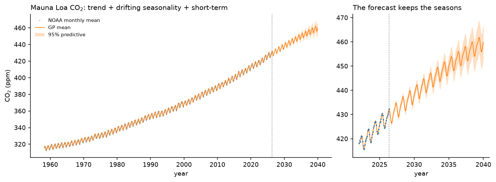

*Mauna Loa CO₂, 819 monthly means (1958–2026), fit with a hand-composed
kernel — RBF trend + (Periodic × RBF) drifting seasonality + Matérn-3/2
short-term — whose nine free hyperparameters are set by maximizing the
evidence. The seasonal period is frozen at exactly 1 year (known physics; it
also removes a gradient instability). The forecast to 2040 keeps the seasons
because the kernel says the correlation is exactly periodic.*

## Problem

A Gaussian process places a prior directly on functions: any finite set of
values $f(X)$ is jointly Gaussian with covariance $K_{ij} = k(x_i, x_j)$.
With Gaussian observation noise, the posterior is Gaussian in closed form —
no MCMC, no variational bound — so regression, uncertainty, and model
selection all reduce to linear algebra. This repo implements that linear
algebra from scratch, the kernels and their gradients by hand, and then
follows the same math out to its large-width neural-network limit.

Everything rests on one identity — $(f(X_*), y)$ is jointly Gaussian — and
Gaussian conditioning via the Schur complement (derived in
[`theory/derivations.md`](theory/derivations.md), Sec. 1):

$$\mu_* = K_*^\top (K + \sigma^2 I)^{-1} y, \qquad \Sigma_* = K_{**} - K_*^\top (K + \sigma^2 I)^{-1} K_*.$$

The inverse is never formed. With $L = \operatorname{chol}(K + \sigma^2 I)$,
predictions are two triangular solves and the log-determinant is
$2\sum_i \log L_{ii}$ — free from the same factorization that gives the mean.
Hyperparameters come from **type-II maximum likelihood** (empirical Bayes):
maximize the log evidence

$$\log p(y \mid \theta) = -\tfrac12 y^\top \alpha - \sum_i \log L_{ii} - \tfrac{n}{2}\log 2\pi,$$

whose three terms are data fit, an Occam complexity penalty, and a constant.
Its gradient is the trace identity

$$\frac{\partial}{\partial\theta_j}\log p(y\mid\theta) = \tfrac12\operatorname{tr}\!\big[(\alpha\alpha^\top - K^{-1})\,\partial_{\theta_j}K\big],$$

derived in Sec. 2 and checked against central differences in the tests.

## What's implemented

| Module | Contents |
|---|---|
| [`gp/gp.py`](gp/gp.py) | Exact GP regression via Cholesky; posterior mean/variance; log marginal likelihood **and** its analytic gradient (trace identity); **closed-form leave-one-out CV** (predictive mean/variance and log-CV score from the *same* factorization — O(n³) once, not n refits; R&W 5.4.2); never forms $K^{-1}$ for prediction |
| [`gp/kernels.py`](gp/kernels.py) | RBF, Matérn (½, 3⁄2, 5⁄2), Periodic, RationalQuadratic (RBF scale mixture; → RBF as α→∞), **ARD** (per-dimension lengthscales; → isotropic RBF when equal), **Gibbs** (nonstationary — input-dependent lengthscale $\ell(x)=e^{a+bx}$, PSD for any positive $\ell(\cdot)$; → RBF exactly when $b=0$) — each with analytic gradients in **log-parameter space** — plus `Sum`/`Product` composition and a **frozen-hyperparameter mask** (freeze e.g. a known period; `theta`/`grads`/`n_params` all honor it) |
| [`gp/optimize.py`](gp/optimize.py) | Adam on the (negative) log evidence, with a callback for path logging, plus **multi-start ML-II** (the evidence is multimodal — §9) |
| [`gp/rff.py`](gp/rff.py) | **Random Fourier features** (Rahimi & Recht 2007): the RBF's spectral density from Bochner's theorem, a cos/sin feature map that reproduces $k(x,x)$ *exactly*, and Bayesian linear regression in that feature space — the $O(n^3) \to O(nD^2)$ approximate GP (§10) |
| [`gp/nn.py`](gp/nn.py) | A finite-width one-hidden-layer ReLU network with **hand-written backprop** — the empirical object the NTK theory predicts |
| [`gp/ntk.py`](gp/ntk.py) | Arc-cosine kernels $\kappa_0,\kappa_1$ (Cho & Saul 2009), the NNGP and NTK of that network, and the **closed-form linearized-GD trajectory** as a geometric series |

The library depends on NumPy alone. scikit-learn appears only as an
**independent oracle** — in the test suite and in the parity benchmark
(§4) — never inside the library, to cross-check posterior means, variances,
and marginal likelihoods against.

### Kernels set the prior

Before any data is seen, a GP *is* its kernel. Drawing sample paths from the
zero-mean prior — Cholesky-factor $K = k(X,X)$ and map standard normals,
$Lz \sim \mathcal N(0, K)$ (`gp.gp.sample_prior`) — shows what each kernel
assumes about the unknown function. Same lengthscale and variance throughout,
so only the kernel *family* changes:

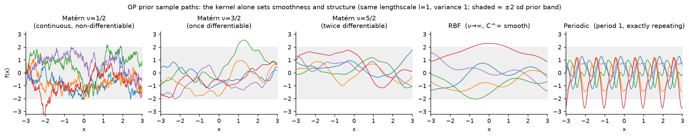

The Matérn family is a smoothness dial: $\nu=\tfrac12$ gives continuous but
nowhere-differentiable paths (Ornstein–Uhlenbeck), $\nu=\tfrac32$ once-
differentiable, $\nu=\tfrac52$ twice-differentiable, and the RBF (the
$\nu\to\infty$ limit) infinitely smooth. The Periodic kernel's draws repeat
exactly — the same construction that lets the CO₂ model above extrapolate a
seasonal cycle. Derivations of the smoothness ladder are in
[`theory/derivations.md`](theory/derivations.md) §5.

## Results

### 1. Is the uncertainty real? (`experiments/validate.py`)

Three checks with known answers.

**Calibration across all levels.** On 40 functions drawn from a known Matérn
prior, the posterior z-scores on held-out latents should be standard normal —
so nominal $q$% intervals should cover $q$% of points, *for every* $q$, not
just 95%. They do; the reliability curve tracks the diagonal.

| nominal | 95% |
|---|---|
| empirical coverage | **0.948** |

**Hyperparameter recovery.** Data generated from known
$(\sigma_f^2,\ell,\sigma_n^2) = (2.0,\ 0.8,\ 0.05)$; ML-II from a generic init
over 8 replicate datasets recovers them:

| parameter | truth | median estimate |
|---|---|---|
| $\sigma_f^2$ | 2.0 | 2.10 |
| $\ell$ | 0.8 | 0.82 |
| $\sigma_n^2$ | 0.05 | 0.05 |

<p align="center">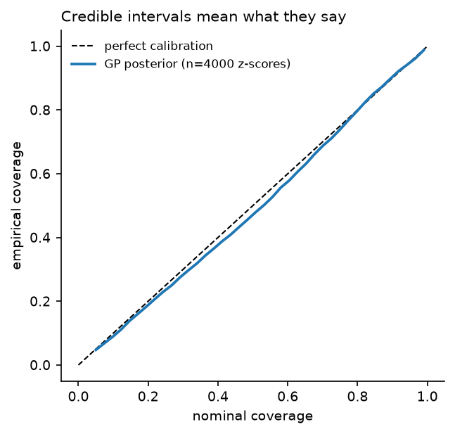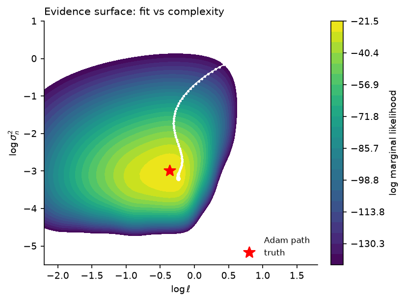</p>

*Left: credible intervals mean what they say. Right: the evidence surface over
$(\log\ell, \log\sigma_n^2)$ with the Adam path climbing to the truth — the
fit-vs-complexity tradeoff made visible.*

### 2. Real data: Mauna Loa CO₂ (`experiments/co2.py`)

The classic GP demonstration (Rasmussen & Williams 2006, §5.4.3): the kernel
is *read off the physics* — a smooth rising trend, an annual cycle whose shape
drifts slowly, and short-term correlated weather — because independent
additive processes add their kernels:

$$k = \underbrace{\text{RBF}}_{\text{trend}} + \underbrace{\text{Periodic}\times\text{RBF}}_{\text{drifting season}} + \underbrace{\text{Matérn-}3/2}_{\text{short-term}} \;(+\ \sigma^2).$$

The seasonal **period is frozen at exactly 1 year** — known physics, and a
numerical necessity: near a phase mismatch the periodic log-period gradient is
$\sim\!10^3$ at init, which destabilized Adam and made an earlier free-period
run diverge and fall back to its initialization. With the period pinned, the
remaining nine hyperparameters optimize smoothly at `lr=0.01` over 800 steps,
and the evidence improves monotonically:

| | LML (init) | LML (best) | improvement |
|---|---|---|---|
| ML-II, 9 free params | −177.2 | −170.9 | **+6.3 nats** (monotonic) |

**Honest out-of-sample evaluation.** Fit on data before 2015, forecast the
held-out 2015–2026 months (11.4 years the model never sees):

| model | held-out RMSE | 95% coverage | trend $\ell$ |
|---|---|---|---|
| hand-set init (no optimization) | **2.46 ppm** | 0.97 | 40 yr |
| ML-II evidence optimum | 8.05 ppm | 0.09 | 21 yr |

The result worth reporting is the one that *isn't* clean: **ML-II raises the
in-sample evidence but extrapolates worse here.** It prefers a shorter trend
lengthscale (21 vs 40 yr) that captures in-sample wiggle; an RBF trend
mean-reverts beyond its lengthscale, so the shorter one undershoots the
continued rise over a decade. ML-II maximizes evidence, not multi-year
forecast skill, and an RBF is a poor prior for an unbounded trend. The
standard R&W remedy — a RationalQuadratic medium-term component (a scale
mixture of RBFs with a heavier tail) — is now implemented in `gp/kernels.py`
with its analytic log-space gradients; swapping it into the CO₂ composite is
the next experiment. Reported as measured, not tuned to the held-out set.

#### Building that kernel, step by step

The composite above is not a black box — it is four physical assumptions, each
one a kernel, combined with `+` and `×`. Two composition rules are all you
need, both a consequence of what a kernel *is* (a covariance):

- **Independent processes add.** If $y = f_1 + f_2$ with $f_1 \perp f_2$, then
  $\operatorname{Cov}(y) = \operatorname{Cov}(f_1) + \operatorname{Cov}(f_2)$, so
  $k = k_1 + k_2$. `Sum` (and the `k1 + k2` operator) does exactly this.
- **Modulation multiplies.** The covariance of a product of independent
  processes is the product of their covariances, so $k = k_1 \times k_2$ lets one
  kernel *gate* another. `Product` (and `k1 * k2`).

Read the physics off the Mauna Loa curve and translate each clause:

```python
from gp.kernels import RBF, Matern, Periodic

# 1. A smooth, decades-long rising trend. RBF, big amplitude (sd 50 ppm),
#    long lengthscale (40 yr) so it is nearly constant across a few years.
trend    = RBF(s2=50.0**2, l=40.0)

# 2. An annual cycle whose SHAPE drifts slowly. Periodic gives the exact
#    12-month repeat (period frozen at 1 yr); multiplying by a long RBF
#    (l=90 yr) lets this year's cycle differ a little from a cycle decades away.
seasonal = Periodic(s2=4.0, l=1.3, p=1.0, fixed=["p"]) * RBF(s2=1.0, l=90.0)

# 3. Short-term correlated "weather". Matern-3/2, lengthscale ~1 yr, decays fast.
short    = Matern(nu=1.5, s2=0.5, l=1.0)

kernel = trend + seasonal + short           # a Sum of (RBF, Product, Matern)
```

The tree carries its own free-parameter bookkeeping, so ML-II optimizes it
without you tracking indices — `Sum`/`Product` split the flat `theta` vector by
each child's `n_params`, and a `fixed=` parameter simply disappears from the
count:

```python
>>> trend.n_params, seasonal.n_params, short.n_params   # Periodic's p is frozen
(2, 4, 2)
>>> kernel.n_params                                     # 8 free (+ noise_var = 9)
8
```

Every number in the composite has a reading you can check numerically. The
prior variance at a point is the sum of the parts (`k(x,x) = 2500 + 4 + 0.5 =
2504.5` ppm²). The `seasonal` term is worth watching because it is the product:
at a **half-year** gap the annual cycle is in antiphase, so its covariance
collapses (`4.0 → 1.22`); at a **full year** it is back in phase (`≈ 4.0`); and
even **ten years** apart it is still `≈ 3.98`, because the RBF envelope
($\ell=90$ yr) has barely decayed — that is precisely "same-shaped season,
drifting by a hair per decade." The `short` Matérn, by contrast, falls from
`0.24` at one year to `0.017` at three: weather, not climate. Add them and you
have a prior that already *looks like* the data before a single hyperparameter
is optimized — which is why the hand-set kernel forecasts as well as it does (§2).

### 3. Wide networks *are* Gaussian processes (`experiments/ntk_experiments.py`)

The same GP math predicts the behavior of a neural network. For a
one-hidden-layer ReLU net $f(x) = \sqrt{2/m}\,a^\top\mathrm{relu}(Wx)$, two
infinite-width limits have closed forms built from the arc-cosine kernels
(Sec. 6–7): the outputs at initialization are a GP with covariance
$\mathrm{NNGP} = 2\kappa_1$, and training dynamics are governed by the
$\mathrm{NTK} = 2\kappa_1 + 2\kappa_0\,(x{\cdot}x')$.

**Outputs Gaussianize as width grows.** The finite net's output distribution
approaches the NNGP — its *variance* matches at any width (to $\le0.3\%$
here), but *Gaussianity* only arrives at rate $1/m$, visible as excess
kurtosis decaying:

| width $m$ | 4 | 16 | 64 | 256 |
|---|---|---|---|---|
| \|excess kurtosis\| | 3.75 | 0.95 | 0.23 | **0.057** |
| \|var − NNGP\|/NNGP | 0.0018 | 0.0024 | 0.0009 | 0.0023 |

**Trained-network predictions converge to closed-form kernel regression.** The
max gap between the actual net's GD trajectory and the linearized (NTK)
prediction shrinks with width:

| width $m$ | 64 | 256 | 1024 | 4096 |
|---|---|---|---|---|
| max \|net − linearized\| | 0.386 | 0.271 | 0.114 | **0.069** |

<p align="center">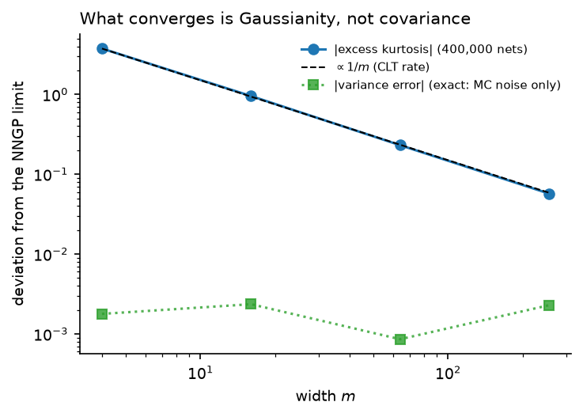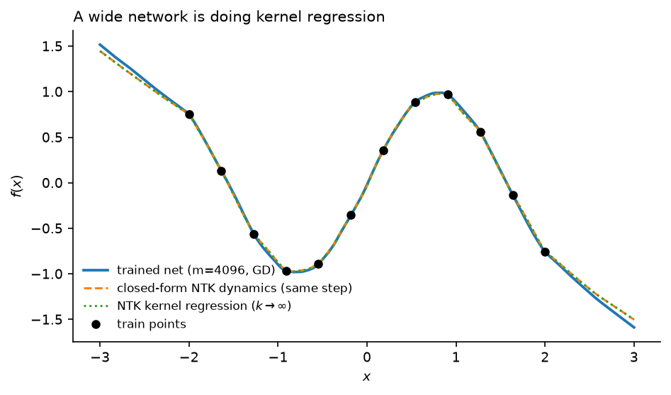</p>

*Left: the output histogram tightening to the Gaussian NNGP as $m$ grows.
Right: a trained finite net (dots) tracking its analytic NTK-regression limit
(line).*

### 4. Parity and speed vs scikit-learn (`experiments/sklearn_parity.py`)

Fitting the *same* kernel at the *same* fixed hyperparameters, our NumPy
implementation reproduces scikit-learn's exact-GP posterior to floating-point
parity, at a small constant-factor time cost (both are $O(n^3)$; the ratio is
implementation overhead, not worse asymptotics):

| $n$ | max&#124;Δmean&#124; | max&#124;Δstd&#124; | ours (ms) | scikit-learn (ms) | ratio |
|---|---|---|---|---|---|
| 100 | 1.7e-10 | 1.6e-10 | 0.5 | 0.5 | 1.1× |
| 400 | 4.2e-11 | 1.2e-10 | 3.4 | 1.9 | 1.8× |
| 800 | 6.7e-11 | 7.8e-11 | 16.8 | 9.5 | 1.8× |

The point is the left two columns: the from-scratch math is correct to ~1e-10,
and the ~1.8× overhead is the honest price of readable NumPy over a tuned
library (timings: single core, best of 3).

### 5. Heteroscedastic noise: a two-stage fit (`experiments/heteroscedastic.py`)

When the noise level varies with $x$, one global $\sigma^2$ can't win: the
band is too wide where data are clean and too narrow where they are noisy.
The two-stage remedy (Goldberg et al. 1998) fits a **second GP to the
log-noise**: take the signal GP's leave-one-out residuals (R&W §5.4.2), fit a
smooth GP to $\log r_i^2$, undo the $\log\chi^2_1$ bias
($\mathbb{E}[\log\chi^2_1]=-1.2704$), and refit with the per-point variances
$\sigma^2(x_i)$ on the diagonal (`fit(..., noise=...)`).

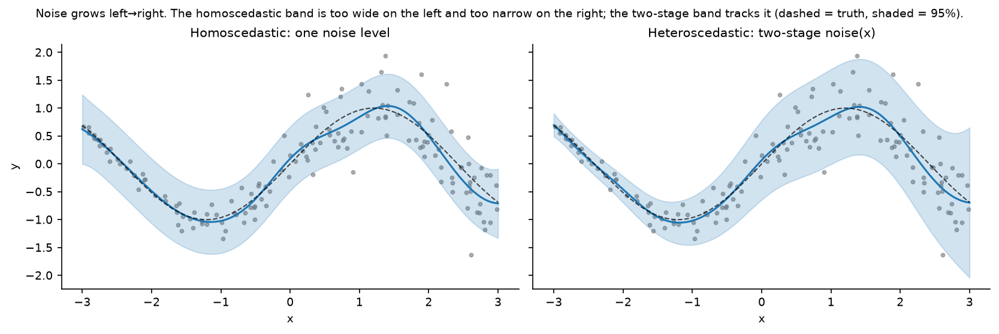

The gain is calibration. On data whose noise grows left→right, nominal 95%
intervals should cover 95% *in every region*:

| | left (clean) 95% cover | right (noisy) 95% cover | test NLL |
|---|---|---|---|
| homoscedastic | 1.00 (over-covers) | 0.87 (under-covers) | 0.230 |
| heteroscedastic | 0.96 | 0.96 | **0.013** |

The single-noise fit splits the difference — too conservative on the left,
overconfident on the right; the two-stage fit tracks the true noise and is
well-calibrated across the domain (robust across seeds).

### 6. ARD: the model discovers which inputs matter (`experiments/ard.py`)

The isotropic RBF forces one lengthscale on every input axis. The **ARD**
kernel gives each axis its own $\ell_d$, and ML-II turns that into automatic
feature selection: the marginal likelihood gains nothing from covariance
structure along an irrelevant axis (it only pays the $\log|K|$ penalty), so the
optimizer drives that axis's lengthscale up until the kernel is flat along it.

Toy with two inputs where $y = \sin(2x_0) + 0.3x_0 + \varepsilon$ depends on
$x_0$ **only** ($x_1$ is pure noise). ML-II on an ARD-RBF from an isotropic
start ($\ell_0=\ell_1=1$):

| | relevant $x_0$ | noise $x_1$ |
|---|---|---|
| learned $\ell_d$ | 1.09 | **171** |
| relevance $1/\ell_d$ | 0.92 | **0.006** |

$x_1$'s lengthscale is driven **157× larger**, so $1/\ell_1 \approx 0$: the
prediction becomes invariant to $x_1$ (the three $x_1$-slices below coincide).
Decoupling the axes also raises the evidence — ARD log-marginal-likelihood
**77.2** vs the isotropic RBF's **13.8** on the same data, because one shared
lengthscale cannot be both short enough for $x_0$'s wiggle and long enough to
ignore $x_1$.

<p align="center">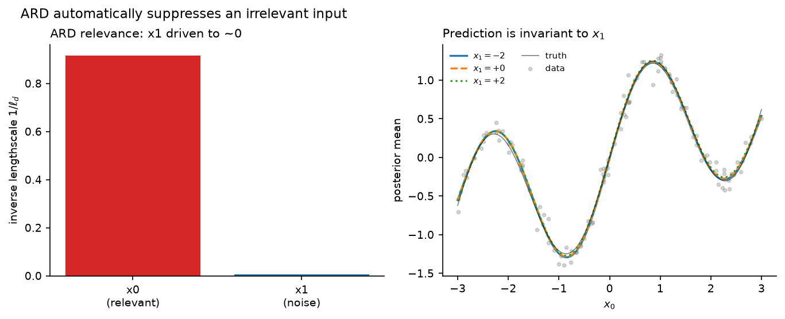</p>

### 7. A 2D spatial GP: interpolation *and* honest uncertainty (`experiments/spatial2d.py`)

The GP story is clearest in 2D, where both the posterior mean and the posterior
**standard deviation** are surfaces you can look at. We sample a smooth two-bump
field on $[-3,3]^2$ at 140 scattered locations with noise sd $0.05$, fit an
isotropic RBF by ML-II, and predict on a dense grid:

| | value |
|---|---|
| held-out RMSE (field amplitude $\approx 1$) | **0.027** |
| latent 95% coverage on the grid | **0.973** |
| posterior sd, near data → gaps/edges | **0.019 → 0.113** |

The point is the third row (panel **c**): a GP does not just interpolate, it
reports *where it is guessing* — the standard deviation collapses at each
observation and swells in the gaps and past the domain edges, relaxing toward
the prior. That is the uncertainty a plain interpolator cannot give you.

<p align="center">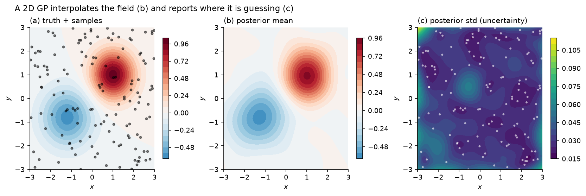</p>

### 8. When one lengthscale is not enough (`experiments/gibbs_kernel.py`)

Every kernel above is **stationary**: $k(x,x')$ depends only on $x-x'$, so one
lengthscale governs the whole input space. The **Gibbs (1997) kernel** relaxes
that — let $\ell(x)$ vary with the input, and

$$k(x,x') = \sigma_f^2 \sqrt{\frac{2\,\ell(x)\ell(x')}{\ell(x)^2+\ell(x')^2}}
\;\exp\!\Big(\frac{-(x-x')^2}{\ell(x)^2+\ell(x')^2}\Big)$$

is PSD for *any* positive $\ell(\cdot)$. The square-root prefactor is what buys
that: it damps the covariance between two points that disagree about the
lengthscale. With $\ell$ constant it equals 1 and the whole thing collapses to
the RBF exactly (tested). We take $\ell(x) = e^{a+bx}$, so the tilt $b$ is
learned by ML-II like any other hyperparameter.

The target is a **chirp**, $y=\sin(x^3)+\varepsilon$ on $[0,2.2]$ — nearly flat
on the left, oscillating hard on the right, a ~20× spread of local lengthscale
inside one dataset. ML-II recovers exactly that ($n=60$):

| | learned lengthscale | log evidence |
|---|---|---|
| RBF (stationary) | $\ell = 0.183$, one number for the whole domain | 23.97 |
| **Gibbs** | $\ell(0)=1.55 \to \ell(2.2)=0.13$ (**11.8×** range) | **32.34** (**+8.4 nats**) |

**But does it predict better? Only when data is scarce** — and this is the
honest part. The evidence prefers Gibbs at every sample size, but a stationary
RBF is not helpless: it copes by picking the *short* lengthscale the rough
region demands ($0.18$, versus the $1.55$ the smooth region wants) and then
leaning on sheer data density to interpolate the smooth half anyway. That crutch
only exists while the data is dense:

| $n$ | evidence gap | smooth-region RMSE (Gibbs / RBF) | held-out NLL (Gibbs / RBF) |
|---|---|---|---|
| 40 | +5.5 nats | **0.105** / 0.128 | **−0.754** / −0.635 |
| 60 | +8.4 nats | **0.106** / 0.111 | **−0.786** / −0.744 |
| 90 | +10.8 nats | 0.092 / 0.093 | −0.906 / −0.891 |
| 140 | +11.3 nats | 0.110 / 0.112 | −0.868 / −0.848 |

So the claim is *not* "nonstationary kernels predict better". It is that a
stationary kernel pays for its wrong lengthscale **in the currency of data**,
and you only notice when data is what you are short of. At $n=140$ the two are
indistinguishable to three decimals; at $n=40$ the Gibbs kernel cuts
smooth-region RMSE by ~18%.

Scope, honestly: $\ell(x)=e^{a+bx}$ is *monotone*, which is the right shape for
a chirp and the wrong one for (say) a single localized bump. A richer $\ell(\cdot)$
— a second GP on $\log \ell$, as in Paciorek & Schervish (2004) — is the natural
extension and is **not** implemented here. 1D input only.

<p align="center">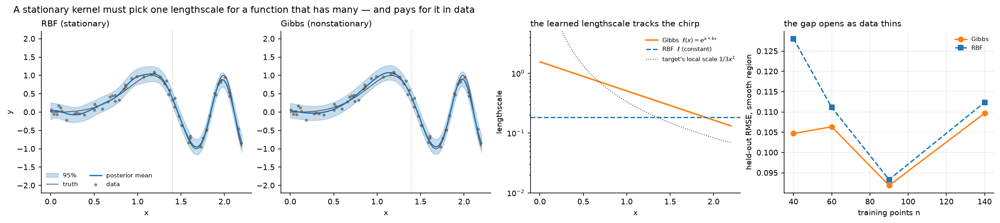</p>

### 9. ML-II is non-convex: multi-start beats multimodal evidence (`experiments/multistart.py`)

Every result above sets the kernel by ML-II — maximizing the log marginal
likelihood over the hyperparameters. That objective is **not convex**, and in the
standard case it is genuinely **multimodal** (Rasmussen & Williams 2006, Fig.
5.5): a sparse, wiggly dataset admits two competing explanations, each a local
optimum of the evidence —

- **signal**: a short lengthscale with almost no observation noise (the function
  really wiggles), versus
- **noise**: a long, flat lengthscale with large noise (the wiggles are
  measurement error around a near-constant mean).

A single gradient ascent commits to whichever basin its initialization sits in.
On a 12-point set the two basins are decisively unequal — but a naive
long-lengthscale start lands in the *worse* one:

| fit | lengthscale $\ell$ | noise $\sigma^2$ | log evidence |
|---|---|---|---|
| signal-mode single start | 1.29 | ~0 | **−5.40** |
| noise-mode single start | 98 | 0.58 | −13.74 |
| **multi-start** (from the noise init) | 1.29 | ~0 | **−5.40** |

`gp.optimize.maximize_lml_multistart` runs Adam ML-II from several log-space
initializations — the model's own parameters plus draws sampled uniformly in a
log-space box (the same strategy as scikit-learn's `n_restarts_optimizer`) — and
keeps the highest-evidence fit. Started in the noise basin, it still recovers the
signal optimum (+8.3 nats), and with `keep_init=True` restart 0 is the model's
own parameters, so it can never return worse evidence than the single fit it
wraps. The right panel profiles the evidence along the lengthscale (freezing
$\ell$ on a grid via the fixed-parameter mask and optimizing $\sigma_f^2,
\sigma^2$ at each point): one sharp peak at the signal lengthscale, a long flat
plateau where the model has given up and called everything noise.

<p align="center">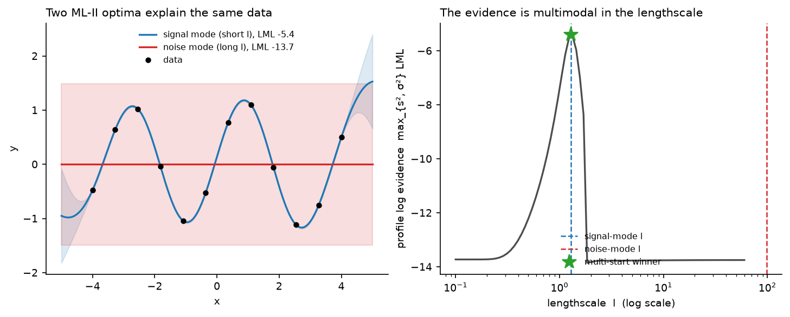</p>

### 10. Random Fourier features: buying $O(nD^2)$ with Monte Carlo (`experiments/rff.py`)

Everything above is the *exact* GP, and every one of its costs is a cost of the
$n \times n$ Gram matrix. **Bochner's theorem** says a continuous stationary
kernel is positive definite exactly when it is the Fourier transform of a
finite non-negative measure — so, normalized, $k(x-x') = \sigma_f^2\,
\mathbb E_{w\sim p}[\cos(w\cdot(x-x'))]$ for the kernel's *spectral density*
$p(w)$, and for the RBF that density is exactly $\mathcal N(0, \ell^{-2}I)$
(short lengthscale $\Rightarrow$ wide band of frequencies). A kernel written
as an expectation can be estimated by Monte Carlo: draw $m = D/2$ frequencies,
pair a cosine with a sine at each,

$$z(x) = \sqrt{\sigma_f^2/m}\,\big[\cos(w_j\!\cdot\! x),\ \sin(w_j\!\cdot\! x)\big]_{j=1}^{m}, \qquad z(x)\cdot z(x') = \frac{\sigma_f^2}{m}\sum_j \cos\big(w_j\!\cdot\!(x-x')\big),$$

and the kernel becomes an explicit inner product in $\mathbb R^D$. The cos/sin
pairing rather than Rahimi & Recht's $\cos(w\cdot x + b)$ is a real choice:
both are unbiased, but paired has strictly lower variance for the RBF (proved
in [`theory/derivations.md`](theory/derivations.md) §8.2, and measured), and
$z(x)\cdot z(x) = \sigma_f^2$ holds **exactly** — per frequency, by
$\cos^2+\sin^2=1$ — so the prior variance carries no Monte Carlo noise at all.

With the map fixed, the model is *not* an approximate GP: it is the exact GP of
the finite-rank kernel $k_D(x,x') = z(x)\cdot z(x')$, done in weight space at
$O(nD^2 + D^3)$ instead of function space at $O(n^3)$. `RFFRegressor` and
`GPRegressor(RFFMap(...))` are checked to agree to $10^{-8}$, which pins the
*only* error source to $k_D \approx k$.

**The rate.** Monte Carlo, so $D^{-1/2}$, with no dependence on input
dimension. Four times the features buys twice the accuracy:

| $D$ | max $\lvert k_D - k\rvert$ (median of 9 draws) | max $\lvert \mu_D - \mu_{\text{exact}}\rvert$ | max $\lvert s_D - s_{\text{exact}}\rvert$ |
|---|---|---|---|
| 16 | 0.472 | 0.034 &nbsp;*(worst draw 0.93)* | 0.018 |
| 64 | 0.239 | 0.022 | 0.010 |
| 256 | 0.125 | 0.021 | 0.006 |
| 1024 | 0.076 | 0.0095 | 0.0026 |
| 4096 | 0.035 | 0.0060 | 0.0016 |

(posterior columns at $n=800$, same hyperparameters both sides, against a
posterior mean spanning $\pm 1.52$.) 256× the features bought **13.5×** the
kernel accuracy where the rate predicts 16×. That exchange rate is the honest
summary of the method: RFF is a tool for making $n$ large, not for making error
small — and at $D=16$ the *spread over draws* reaches 0.93, i.e. a bad draw of
eight frequencies is simply a bad model.

**The payoff.** Cubic versus linear in $n$, so the curves cross and then
separate (fit + predict, same machine, $D = 512$):

| $n$ | exact GP | RFF, $D=512$ | speedup | max mean error |
|---|---|---|---|---|
| 500 | 0.006 s | 0.008 s | 0.8× | 2.2e−2 |
| 1000 | 0.026 s | 0.010 s | 2.7× | 8.8e−3 |
| 2000 | 0.160 s | 0.013 s | 12× | 9.0e−3 |
| 4000 | 1.19 s | 0.020 s | 59× | 9.2e−3 |
| 8000 | 8.36 s | 0.033 s | **252×** | 4.4e−3 |

**What breaks — variance starvation.** A rank-$D$ model has $D$ degrees of
freedom in total. Once $n \gg D$ the data pins essentially all of them and the
posterior variance collapses where an exact GP correctly widens. With
$n = 3000$ and a gap in $\lvert x\rvert < 1.2$, the exact posterior sd at the
gap centre is **0.97**, and RFF loses roughly half of it at $D = 64$
(Wang et al. 2018):

| | sd at the gap centre, median of 9 feature draws | range over the draws | max mean error *in the gap* | …*where the data are* |
|---|---|---|---|---|
| exact GP | 0.97 | — | — | — |
| $D = 2048$ | 0.954 &nbsp;(0.99×) | [0.922, 0.960] | 0.129 | 0.006 |
| $D = 64$ | 0.505 &nbsp;(0.52×) | **[0.088, 0.635]** | 0.527 | 0.009 |

Two things in that table are corrections to what this section used to claim,
both found by re-measuring it against a second approximation:

- **The error bar.** This section previously reported $D = 64$ giving **0.088**,
  a tenth of the honest uncertainty. That is a real fit, but it is
  `default_rng(0)` — and across nine draws of the feature map it is the *worst*
  of the nine, against a median of 0.505. At $D = 64$ the frequencies are few
  enough that which ones come up matters more than $D$ does: the spread runs
  7×, while at $D = 2048$ the same nine draws span only 0.922–0.960. The
  qualitative claim survives and the digits did not — even the best draw is 34%
  below exact, and no draw is close.
- **The mean.** This section previously said "the mean is still fine there".
  It is not: split by region, the median $D = 64$ draw is off by **0.527** in
  the gap and 0.009 where the data are, a 56× difference against a posterior
  mean spanning $\pm1.5$. The whole-domain max in the table above hid it,
  because 70% of the domain has data in it. Even $D = 2048$, whose error bar is
  99% of the honest one, is 22× worse in the gap than on the data. What fails
  in the gap is the *posterior*, not just its second moment.

Raising $D$ is the only fix within RFF. §11 keeps the kernel and approximates
the posterior instead, and §13 spends the same rank budget both ways in the
same gap.

<p align="center">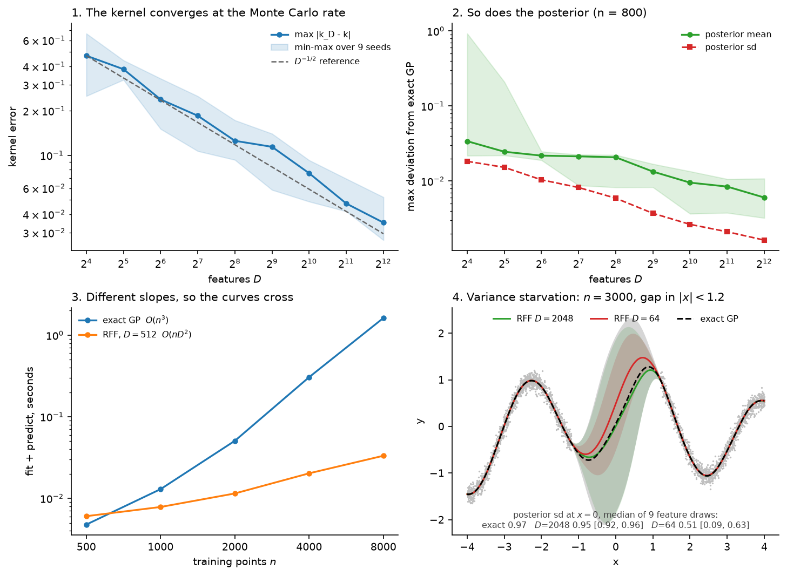</p>

One consequence worth stating plainly: `RFFMap` exposes no gradients, so ML-II
cannot be run through it as written — the frequencies are drawn *from* a
density that depends on $\ell$. Fit the exact GP's hyperparameters first (on a
subset if $n$ is large), then build the map at those values.

### 11. How many inducing points, and where they end up (`experiments/sparse.py`)

§10 replaced the *kernel* with a randomized finite-rank surrogate. The other
route keeps the model exactly and approximates the *posterior*: summarize $f$
through $M$ inducing variables $u = f(Z)$ at locations $Z$ you choose
(Titsias 2009; derived in [`theory/derivations.md`](theory/derivations.md) §9,
implemented in [`gp/sparse.py`](gp/sparse.py)). Augmenting the model with $u$
changes nothing — it is the same GP evaluated at $M$ more inputs — so with the
variational $q(u)$ collapsed to its optimum, the log evidence acquires a lower
bound

$$F = \log \mathcal N(y \mid 0,\, Q_{ff} + \sigma^2 I) - \tfrac{1}{2\sigma^2}\operatorname{tr}(K_{ff} - Q_{ff}), \qquad Q_{ff} = K_{fu}K_{uu}^{-1}K_{uf}.$$

The first term is the older DTC approximation; the trace term is the penalty
for an inducing set that fails to explain $f$, and it is what makes $F$ a
*bound*. That is not decoration: the DTC term alone measures **above** the exact
evidence (296.28 against 292.91 at $M = 16$, $n = 400$ — a test, not a remark),
so dropping the trace does not give a looser bound, it gives something that is
not a bound at all.

Two questions follow. How large must $M$ be? And is optimizing $Z$ worth it —
which the bound licenses, because $Z$ are variational parameters rather than
model parameters, so more of them cannot overfit the way a free hyperparameter
would. The target is deliberately two-scale, $\sin(1.1x) + 0.6\sin(5x)$ for
$x > 0$ with $n = 800$ split 50/50 across $x = 0$, so one half of the domain is
5× harder than the other. The exact GP's own ML-II fit ($\ell = 0.4563$,
$\sigma^2 = 0.0093$ against a true $0.01$) gives log evidence **660.925**, and
every row below is a gap measured *below* that ceiling.

| $M$ | opt. $Z$: gap | mean err | sd err | frozen $Z$: gap | mean err | sd err |
|---|---|---|---|---|---|---|
| 2 | 1242.77 | 1.230 | 0.154 | 1573.45 | 1.555 | 0.031 |
| 4 | 901.41 | 0.660 | 0.133 | 928.14 | 0.766 | 0.118 |
| 8 | 868.16 | 0.647 | 0.065 | 872.10 | 0.621 | 0.033 |
| 12 | 269.23 | 0.134 | 0.127 | 849.22 | 0.611 | 0.077 |
| 16 | 79.37 | 0.088 | 0.087 | 187.61 | 0.212 | 0.073 |
| 24 | **1.39** | 0.017 | 0.010 | 4.25 | 0.021 | 0.016 |
| 32 | 0.00 | 0.0001 | 0.0000 | 0.11 | 0.0019 | 0.0017 |
| 64 | 1.6e−06 | 0.0000 | 0.0000 | 4.0e−06 | 0.0000 | 0.0000 |

The gap is monotone in $M$ and never negative in either arm — the bound
behaving as derived. Optimizing $Z$ is worth **1.3–2× in inducing points**
(optimized $M{=}8$ matches frozen $M{=}12$, optimized 32 matches frozen 48) for
4% more wall clock: 1.20 s against 1.15 s per fit, 400 Adam steps each. And the
transferable answer to "how large must $M$ be" is not a count but a spacing —
what matters is how finely $Z$ sample the *kernel*, and the gap collapses at
about **0.7 fitted lengthscales** between neighbours ($M{=}24$: 0.76 $\ell$,
gap 1.4 nats; $M{=}32$: 0.61 $\ell$, gap 0.00).

**Two things this experiment was written to show, and did not.**

- **Posterior error is not monotone in $M$** — in either arm. The optimized
  arm's sd error rises at $M = 12$ and again at 64; the frozen arm's at 4 and
  12. Nothing is broken: each $M$ is a *separate* joint ML-II fit, so the
  quantity that is monotone is the bound, which brackets one fixed number from
  below at every $M$. The posterior that fit implies carries no such guarantee,
  and the table is the reminder that "the bound converged" and "the posterior
  converged" are different claims.
- **The inducing points do not cluster where the function is hard.** Against a
  5× frequency ratio, the $M = 64$ optimum puts 36 of 64 (56%) in the fast half
  at a median spacing 1.15× denser — real, and far too weak to be the story. A
  control settles it: redraw the data 3:1 toward the *slow* half, leaving the
  function alone (the exact GP still fits $\ell = 0.4083$), and the sign
  reverses — 25 of 64 (39%) in the fast half, 1.71× denser where the **data**
  are. Density outweighs difficulty.

The natural explanation for that second one is wrong, and finite differences
say so. The tempting story is that $Z$ chase data because the trace penalty is a
sum of conditional variances at the *training inputs* and never looks at $y$.
But split $\partial F/\partial Z$ into its two terms at the quantile init and
the $y$-blind trace contributes 92.37 against the $y$-aware DTC term's 419.95 —
the two summing to the analytic gradient to 1.1e−06, which is the check that
the split is real. Most of the force moving $Z$ is the part that *is* looking at
the data. The hypothesis this measurement was written to confirm is the one it
refuted.

<p align="center">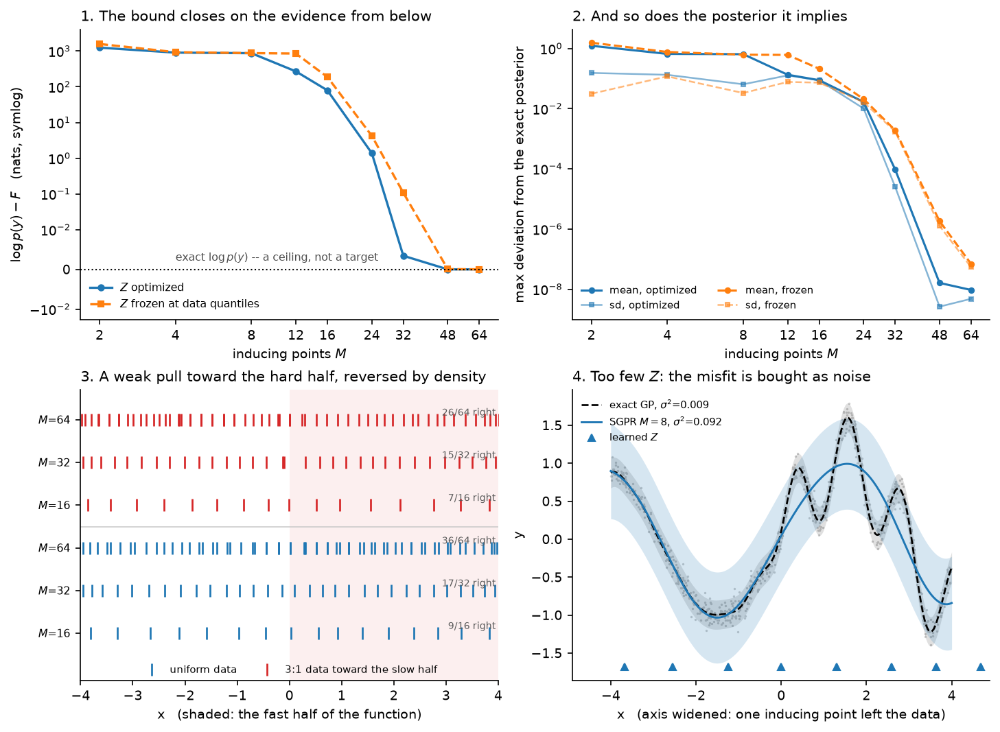</p>

### 12. FITC: one flag, and a different way to fail (`experiments/fitc.py`)

FITC (Snelson & Ghahramani 2006) differs from the bound above in exactly one
move. Where VFE *penalizes* the shortfall $K_{ff} - Q_{ff}$ with a trace, FITC
*absorbs* its diagonal into the likelihood, giving every training point its own
extra noise $\Lambda_{ii} = k_{ii} - q_{ii}$. So both are one implementation
over a general observation diagonal $D$ — $\sigma^2 I$ for VFE,
$\Lambda + \sigma^2 I$ for FITC — sharing the factorization, the predictive
equations and the gradient contraction, with only the noise block branching.
`SGPR(..., method="fitc")` is the whole difference. Both are finite-difference
checked over 7 kernels in 1D and 2D, and at $Z = X$ both reproduce
`GPRegressor.lml_and_grad` while their $Z$-gradients vanish.

The consequence is that FITC's extra noise is heteroscedastic and, crucially,
*free*: wherever the inducing set explains $f$ badly, $\Lambda_{ii}$ absorbs the
misfit and $\sigma^2$ does not have to. On a clumped design (six clusters of 25,
true $\sigma^2 = 0.09$, five replicates per cell; the exact GP's own ML-II lands
at $0.0918 \pm 0.0093$ with coverage 0.959 and NLPD 0.266):

| $M$ | | fitted $\sigma^2$ | $\operatorname{tr}(K_{ff}-Q_{ff})$ | sd/exact | 95% cov. | NLPD |
|---|---|---|---|---|---|---|
| 6 | VFE | 0.1091 ± 0.0109 | 0.450 | 1.076 | 0.960 | 0.325 |
| 6 | FITC | 0.0522 ± 0.0283 | 8.712 | 1.033 | 0.920 | 0.529 |
| 10 | VFE | 0.1004 ± 0.0097 | 0.434 | 1.043 | 0.959 | 0.290 |
| 10 | FITC | 0.0457 ± 0.0141 | 8.022 | 0.984 | 0.909 | 0.366 |
| 20 | VFE | **0.0918** ± 0.0093 | 0.008 | 1.000 | 0.959 | 0.266 |
| 20 | FITC | 0.0279 ± 0.0184 | 10.446 | 0.956 | 0.880 | 0.611 |
| 40 | VFE | 0.0918 ± 0.0093 | 0.000 | 1.000 | 0.959 | 0.266 |
| 40 | FITC | 0.0567 ± 0.0157 | 5.481 | 0.968 | 0.933 | 0.314 |

VFE at $M = 20$ recovers the exact GP's ML-II noise to four decimals and drives
its shortfall to zero. FITC's shortfall *rises* with $M$ — 8.7, 10.4, still 5.5
at $M = 40$ — because nothing charges it for the shortfall; $\Lambda$ pays. What
that costs is calibration: at $M = 20$, held-out coverage 0.880 against a
nominal 0.95, and NLPD 0.611 against the exact GP's 0.266.

**Two results here were not the expected ones.**

- **"FITC drives the noise toward zero" is a tail, not the typical fit.** The
  cell means are a 1.6–3.2× underestimate — a bias, not a collapse. The
  collapse is real but lives in individual fits: 2 of 20 clumped fits land below
  a fifth of the truth (worst **0.00129**, 1.4% of $\sigma^2$), and 0 of 20 on
  the uniform control. Quoting the mean alone would hide the failure mode;
  quoting the worst case alone would overstate how often it happens.
- **The sign of the variance error depends on where you measure it.** At
  $M = 20$ clumped, FITC's predictive sd is 0.956× exact on held-out *data* and
  1.215× exact on a uniform grid over the same domain — too narrow where the
  data are, too wide between them. That is precisely what a per-point noise term
  should do, and it means "FITC is overconfident" is not a well-defined number
  without saying where.

**The counterweight, because the uniform control is not a FITC-only story:**
VFE's own bias runs the other way and is larger at small $M$. On the uniform
design at $M = 6$ it fits $\sigma^2 = 0.174$ — 1.9× the truth — with a
predictive sd 1.37× exact. VFE cannot hide unexplained signal in $\Lambda$, so
it books it as noise. Being too conservative is the safe method's failure mode,
and the trace penalty is what buys it back as $M$ grows (0.750 → 0.004).

One last practical difference: FITC's objective is **not a bound in either
direction** — 253 nats below the exact evidence at $M = 16$ and 1.1 nats above
it at $M = 32$, both tested — so unlike $F$ it cannot be read as a certificate
of how much evidence the approximation gave up.

<p align="center">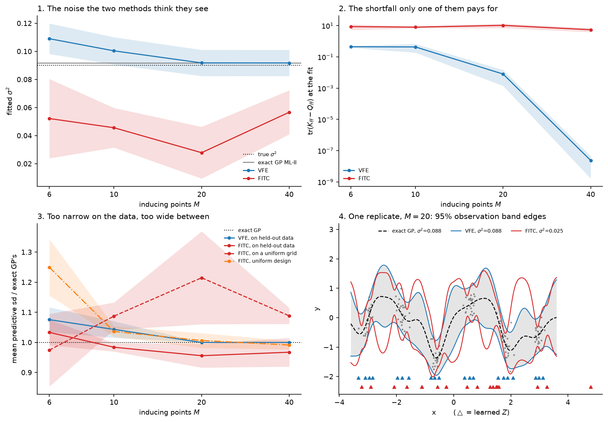</p>

### 13. Two ways to spend a rank budget (`experiments/rff_vs_sparse.py`)

§10 and §11 are two routes to the same $O(nR^2)$: RFF approximates the kernel,
SGPR approximates the posterior. They differ in **where the rank goes** — RFF
picks $R$ global sinusoids from the spectral density before seeing the data;
SGPR picks $R$ local basis functions $k(\cdot, z_m)$ sited on the input space.
So put them in the same gap and see which spends the budget better.

The setup is *imported* from `rff.py` rather than restated — same target, same
$n = 3000$, same gap in $\lvert x\rvert < 1.2$, same kernel hyperparameters in
every arm, 5 datasets × 9 feature draws. **$Z$ is
never optimized**: it is placed at the data quantiles and left alone, so nothing
below is a tuned method beating an untuned one.

**Posterior sd at the gap centre** (exact GP: **0.9655**):

| rank $R$ | RFF, median [min, max] | SGPR, quantile $Z$ | SGPR, blind grid $Z$ |
|---|---|---|---|
| 16 | 0.072 &nbsp;[0.011, 0.232] | 0.998 | 0.840 |
| 32 | 0.100 &nbsp;[0.061, 0.529] | 0.969 | 0.966 |
| 64 | 0.504 &nbsp;[0.086, 0.637] | **0.9656** | 0.9655 |
| 256 | 0.765 &nbsp;[0.608, 0.952] | 0.9655 | 0.9655 |
| 2048 | 0.954 &nbsp;[0.919, 0.962] | 0.9655 | 0.9655 |

**Matched rank is not matched cost, and the two disagree.** Per unit of rank
RFF is *cheaper* — 2.4× at $R = 2048$, up to 25× at small $R$ — because SGPR
pays $nM$ kernel evaluations and two triangular solves where RFF pays one
matrix product. Judge instead by the cost to reach a fixed accuracy, and
require accuracy in **both moments**: the error bar within 5% of exact *and*
the posterior mean within 5% of the signal's span everywhere.

| | error bar only | mean only | both | cost |
|---|---|---|---|---|
| RFF | $R = 1024$ | never | **never** | — |
| SGPR, quantile $Z$ | $R = 4$ | $R = 32$ | **$R = 32$** | 0.0043 s = 0.9% of the exact GP |

RFF never gets there at any rank in the sweep: its in-gap mean error is still
0.201 at $R = 2048$, having fallen only 3.1× over a 32× rank increase, while
its error outside the gap is 0.006. Both halves of the criterion are load-
bearing, and the reason is in the SGPR row: at $R = 4$ SGPR reports the gap sd
as 1.0000, inside 5% of exact — but only because $Q_{**}\approx 0$ there, so it
has returned the *prior*. It is right about the error bar the way a model that
knows nothing is right, and its mean is off by 1.35. Scoring the error bar
alone would reward whichever method degrades toward the prior fastest.

**The counterweight: this is a result about placement, not about inducing
points.** Swap the data quantiles for a blind uniform grid over the domain and
SGPR loses the error bar too — sd **0.371** at $M = 12$ against the exact
0.9655, a 2.6× overconfidence, with a worst deficit of $-0.66$ across the grid.
The mechanism is in the decomposition
$\mathrm{var}(x_*) = [k_{**} - Q_{**}] + [K_{*u}\Sigma^{-1}K_{u*}]$ (§9.8): the
first bracket is a *margin* that only exists where $x_*$ is far from every $z$.
A grid puts an inducing point at $x = 0.364$, inside the empty region, which
spends the margin — 0.093 there against 0.999 for quantile $Z$ — and hands the
band to a $q(u)$ that the data *outside* the gap has over-determined.

| $Z$ rule | nearest $z$ | margin $k_{**}-Q_{**}$ | $K_{*u}\Sigma^{-1}K_{u*}$ | sd |
|---|---|---|---|---|
| data quantiles | $-1.424$ | 0.9991 | 0.0000 | 0.9996 |
| blind uniform grid | $+0.364$ | 0.0931 | 0.0446 | 0.3710 |

RFF is still worse than the blind grid at every matched rank, which is the
honest bound on how far this reaches. The usable summary: a placement rule that
follows the *data* — quantiles, or a random subset of $X$ — keeps the error bar
for free, and one that follows the *domain* does not.

<p align="center">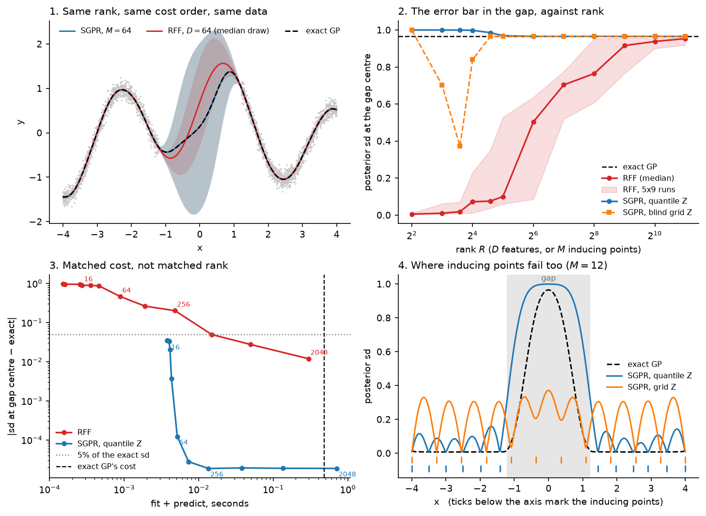</p>

### 14. What it all costs, measured (`experiments/cost_scaling.py`)

Every section above quoted a complexity — $O(n^3)$ and $O(n^2)$ for the exact
GP, $O(nM^2)$ and $O(nM)$ for SGPR — and none of them measured one. This does:
wall clock, peak memory, and the exponents they actually scale at, one
subprocess per cell (peak RSS is a high-water mark and cannot be reset in
process). Memory is reported twice on purpose. **NumPy bytes** is the peak of
what NumPy requested, deterministic on any machine; **RSS** is what the OS
backed, which is what decides whether a fit runs at all.

| $n$ | exact: s | exact: RSS | exact: NumPy | SGPR $M{=}64$: s | SGPR: RSS | speed-up |
|---|---|---|---|---|---|---|
| 1000 | 0.012 | 32 MB | 24 MB | 0.0027 | 5.8 MB | 4.6× |
| 4000 | 0.363 | 407 MB | 384 MB | 0.0087 | 14.5 MB | 42× |
| 8000 | 1.603 | 1.58 GB | 1.54 GB | 0.0167 | 25.2 MB | 96× |
| 16000 | 13.81 | 5.20 GB | — | 0.0342 | 45.8 MB | **404×** |
| 128000 | — | — | — | 0.351 | 338 MB | — |

**The exponents, and why two of them miss.** Fitted over the tail
($n \ge 2000$): exact time $n^{2.64}$ against a theoretical 3, exact memory
$n^{1.87}$ against 2 — and NumPy bytes exactly $n^{2.00}$. SGPR gives
$n^{1.04}$ and $n^{0.99}$. The two that miss are not rounding, and the script
prints what is behind them rather than asserting constants:

- The *time* exponent is still climbing. The local exponent between
  consecutive sizes runs 1.66, 2.04, 2.85, 2.14, 3.11 — the sweep only reaches
  the asymptotic regime at the top, because the $O(n^2)$ kernel evaluation is
  still 22% of the fit at $n = 8000$. Cholesky does not overtake it until
  $n = 4000$.
- The *RSS* exponent misses because RSS counts touched pages: it tracks the
  NumPy request to within 3% up to $n = 8000$ and then falls 15% below it at
  16000, where one of the three matrices below is written only on its diagonal.

**The peak is three copies of the Gram matrix, exactly, and the Cholesky owns
two of them.** Traced at $n = 2400$: `sqdist` alone 2.00 × $8n^2$,
`kernel(X, X)` 2.00, `np.linalg.cholesky` given $K$ 2.00 (its private working
copy plus its output), and a whole `fit` 3.00 — $K$ alive while LAPACK
factorizes a copy of it. The obvious economy, adding the noise diagonal in
place instead of building an $n \times n$ matrix to hold $n$ numbers, was tried
and **is not in the code**: it changes nothing measurable (1578.2 MB vs
1578.5 MB peak RSS, identical NumPy peak), because that allocation reaches 3
copies at its own moment too. Getting below 3 needs an in-place Cholesky, which
NumPy does not expose.

**The wall.** The largest exact fit run here is $n = 16000$: 13.8 s and 5.20 GB.
Everything past that is extrapolation and is labelled as such — the fitted law
$77.2 \, n^{1.87}$ bytes reaches this machine's 17.2 GB at $n \approx 29{,}700$
and would want 166 GB at $n = 10^5$. That is the real end of the exact GP: not
a gradual slowdown but a fit that does not start.

**The crossover, in the other direction.** SGPR at $M = 64$ is *dearer* than
the exact GP below $n \approx 170$ — it still touches all $n$ points and then
does $M \times M$ algebra the exact fit does not.

**In $M$, the theory is barely visible.** At $n = 16000$ the measured time
exponent in $M$ is 0.55, not 2, because the $O(nM^2)$ Gram product is 13% of
the fit at $M = 64$ and does not overtake the $O(nM)$ kernel evaluation until
$M = 1024$. In the range anyone uses, SGPR is bandwidth-bound on evaluating
$k(Z, X)$, not flop-bound on the algebra the complexity is named after.

And what the speed-up cost, on the same data: at $M = 64$ the bound is within
$2.9 \times 10^{-5}$ nats of the exact log evidence at $n = 16000$, with
posterior sd error $3 \times 10^{-6}$. That is a fact about a smooth 1D target
with one lengthscale — §13 is the setting where the same $M$ is not nearly
enough, and it is the one to read this table against.

<p align="center">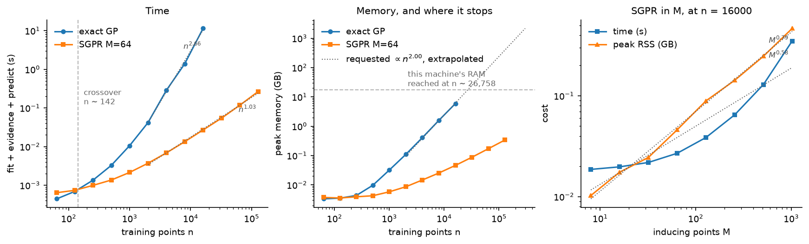</p>

**One bug fell out of this.** `np.linalg.solve(L, B)` is not a triangular
solve. NumPy exposes no triangular solver, so handing it a Cholesky factor runs
a general LU with partial pivoting first — $\frac{2}{3}n^3$ flops, twice the
Cholesky that produced the factor — to get what substitution gets in $n^2$.
`fit` did it twice and `predict` once, so the exact GP spent about four
Choleskys re-factorizing a matrix it had already factorized. `gp/linalg.py`
now does blocked forward and back substitution (all GEMM except a $64 \times 64$
block solve per block row), agreeing with the LU path to 3.6e-16:

| | $n=2000$ | $n=4000$ | $n=8000$ | $n=16000$ |
|---|---|---|---|---|
| before | 0.160 s | 1.218 s | 7.698 s | 57.87 s |
| after | 0.054 s | 0.307 s | 1.527 s | 12.27 s |

The same fix in `gp/sparse.py` and `gp/rff.py` is worth a third at the top of
the rank sweep (SGPR $M = 1024$: 0.603 s → 0.393 s; RFF $D = 2048$: 0.670 s →
0.477 s) and nothing at $M = 64$, since there the factor is small. Every
number elsewhere in this README is unchanged — the suite, including the
scikit-learn parity oracle at 1e-8, passes untouched.

## Reproduce

One command, from a clean clone:

```bash
python -m venv .venv && source .venv/bin/activate
pip install -r requirements.txt && pip install -e .
./reproduce.sh                  # tests, mypy, then all 15 experiments: ~5 min total
```

`requirements.txt` pins the exact versions every committed figure and number was
produced with (Python 3.12.13); `pyproject.toml` keeps lower bounds instead, so
CI goes on testing against current releases on 3.9 and 3.12.

**How exact is it? The script tells you, rather than this paragraph asking to
be believed.** Rerunning the whole suite in that pinned environment regenerates
15 of the 19 committed PNGs byte-for-byte: every experiment is seeded and
NumPy's bit generators are stable across versions, so the datasets, the ML-II
fits, and the tables are identical. The four that differ are
`sklearn_parity.png`, `rff.png`, `rff_vs_sparse.png` and `cost_scaling.png`,
all of which plot wall-clock and so measure the machine — their accuracy
claims (agreement to ~1e-10; the $D^{-1/2}$ error curve; the *exponents*
rather than the seconds) are the portable ones.

`reproduce.sh` ends by checking exactly that against `git status`, and names
any *other* figure that changed. That check exists because the claim was false
when it was written: `co2_forecast.png` and `ntk_linearization.png` had been
shipping as an older environment's bytes — visually the same figure (the CO₂
one is identical pixel for pixel, the NTK one differs in 3 pixels of 372k, and
every number in this README is unchanged), but not what the pinned code
produces. Nothing would have noticed, because nothing was looking. They have
been rebuilt; from now on a drifted figure is a line of output on anyone's
first run.

To run a single experiment instead (timings measured by `reproduce.sh`):

```bash
pytest                          # 272 tests (incl. docstring examples); RuntimeWarnings are errors
mypy                            # static type check of the public API (gp/)
cd experiments
python prior_samples.py         # ~1 s  (kernel prior gallery)
python validate.py              # ~3 s
python co2.py                   # ~2.5 min (ML-II on n~700, 9 free params, twice)
python ntk_experiments.py       # ~5 s
python sklearn_parity.py        # ~1 s  (parity + speed vs scikit-learn)
python heteroscedastic.py       # ~1 s  (two-stage input-dependent noise)
python ard.py                   # ~1 s  (per-dimension lengthscales, relevance)
python spatial2d.py             # ~1 s  (2D field: mean + uncertainty surfaces)
python gibbs_kernel.py          # ~2 s  (nonstationary: input-dependent lengthscale)
python multistart.py            # ~3 s  (ML-II multimodality; multi-restart escapes a bad basin)
python rff.py                   # ~50 s (random Fourier features: rate, speed, and variance starvation)
python sparse.py                # ~35 s (sparse GPs: joint ML-II over Z, convergence in M)
python fitc.py                  # ~40 s (FITC vs VFE: the noise it hides in Lambda)
python rff_vs_sparse.py         # ~90 s (features vs inducing points, same gap)
python cost_scaling.py          # ~40 s (time, memory, exponents; --max-n 8000 skips the top)
```

Figures land in `figures/`; every table above is printed by the scripts.
Seeds are fixed. The only data file, `data/co2_mm_mlo.txt` (the Mauna Loa
monthly record), is committed, so there is nothing to download.

## Design notes

- **Tests assert theory, not just plumbing.** Every kernel gradient is checked
  against central differences; posterior mean, variance, and log marginal
  likelihood are cross-checked against scikit-learn's `GaussianProcessRegressor`
  on shared data; kernels are verified PSD; the frozen-parameter mask is tested
  to zero exactly the right gradient entries.
- **The docs are executable.** The public API's docstring examples are run by
  pytest (`--doctest-modules`), and each recovers a known answer rather than
  printing a plausible-looking number — the LOO example checks the closed form
  against an actual brute-force refit, and the NTK example lands on the exact
  rationals the arc-cosine kernels give at $\theta = 0$. Documentation that
  drifts from the code fails CI.
- **The theory doc has exercises.** [`theory/derivations.md`](theory/derivations.md)
  §9 poses five problems with collapsed solutions — deriving the leave-one-out
  identity, identifying the "it's all noise" evidence optimum as the
  infinite-lengthscale plateau in closed form, proving that warping preserves
  positive-definiteness (and where that argument stops short of the Gibbs
  kernel), proving that random features starve the posterior variance, and
  deriving the $-1.2704$ log-$\chi^2$ correction in the heteroscedastic fit.
  Each ends by naming the test that checks it.
- **The inverse is never formed for prediction.** One Cholesky gives the mean
  (two triangular solves), the pointwise variance (a solve against $K_*$), and
  the log-determinant (a diagonal sum) at once. $K^{-1}$ is materialized only
  inside the LML gradient, where the trace identity genuinely needs it.
- **Gradients live in log space.** All positive hyperparameters are
  parameterized by their logs, so optimization is unconstrained and the chain
  rule contributes one clean factor per parameter (Sec. 4).
- **The NTK section is empirical, not just quoted.** `gp/nn.py` is a real
  finite-width network with hand-written backprop; the tables above measure it
  converging to the analytic kernels, rather than asserting the limit.

## Limitations / next

- **Exact inference is still $O(n^3)$.** Random Fourier features (§10) lift the
  ceiling — 252× at $n=8000$ — but they buy accuracy at the Monte Carlo rate and
  starve the predictive variance once $n \gg D$, so they are a *mean*
  accelerator, not a drop-in replacement. Inducing points (§11–§13, Titsias
  2009) are the alternative that keeps the error bar, and on the gap benchmark
  they reach a fixed accuracy in both moments at rank 32 where RFF does not
  reach it at 2048 — but they carry their own failure mode (a $z$ in an empty
  region is overconfident, §9.8), and FITC (§12) trades the bound for a
  per-point noise term that hides the misfit rather than reporting it.
- **The bound is collapsed, so it needs all of $y$ at once.** Optimizing $q(u)$
  analytically is what makes $F$ tight and cheap, and it is also what rules out
  minibatching: every step touches all $n$ points, so §14's $n = 128{,}000$ row
  is bounded by what fits in memory, not by anything about the method. Keeping
  $q(u)$ explicit and stochastic — SVGP (Hensman et al. 2013) — is the standard
  next step and is not implemented here. Neither are deep or learned kernels,
  which is the other half of what modern sparse GPs do with $Z$.
- **Every sparse measurement here is one-dimensional.** The gradient checks run
  in 1D and 2D, but §11–§13 all live on 1D targets, where "put $Z$ at the data
  quantiles" is a rule that exists. In $d$ dimensions $Z$ carries $Md$ free
  parameters, quantiles stop being defined, and the density-over-difficulty
  result measured in §11 is exactly the kind of finding that need not survive a
  change of dimension. Nothing here tests whether it does.
- **RFF hyperparameters are not learned.** The feature map has no gradients, so
  ML-II has to be run on an exact GP (or a subset) first and the map built at
  those values; §8.6 of the theory doc sketches the reparameterization that
  would make the map differentiable in $\ell$.
- **RBF trend mean-reverts**, which is why ML-II extrapolates the CO₂ series
  poorly (above). The RationalQuadratic kernel — the standard fix — is now
  implemented; wiring it into the CO₂ composite and re-measuring the hold-out
  is the next step.
- **Gaussian likelihood only:** classification (non-Gaussian likelihood) would
  need Laplace or EP, out of scope for this study.

## References

Rasmussen & Williams (2006) *Gaussian Processes for Machine Learning*
(conditioning, LML, the CO₂ example); Cho & Saul (2009) (arc-cosine kernels);
Jacot, Gabriel & Hongler (2018) (the NTK); Lee et al. (2018) / Matthews et al.
(2018) (NNGP) and Lee et al. (2019) (linearized wide networks); Kingma & Ba
(2015) (Adam); MacKay (1998) (the periodic kernel via warping); Goldberg,
Williams & Bishop (1998) (the two-stage heteroscedastic GP); Gibbs (1997) and
Paciorek & Schervish (2004) (the nonstationary input-dependent-lengthscale
kernel); Bochner (1932), Rahimi & Recht (2007), Sutherland & Schneider (2015)
and Wang et al. (2018) (random Fourier features and variance starvation);
Titsias (2009) (the variational bound and inducing-point optimization),
Snelson & Ghahramani (2006) (FITC), Quiñonero-Candela & Rasmussen (2005) (the
DTC/FITC/SoR family the bound sits in) and Bauer, van der Wilk & Rasmussen
(2016) (the VFE-vs-FITC comparison §12 re-measures).
Full list with roles in [`theory/derivations.md`](theory/derivations.md).

## Part of a from-scratch series

Same bar in each: the core written out by hand, every non-obvious claim checked
against a closed form or an independent oracle, limitations stated rather than
buried.

| Repo | Built from scratch |
| --- | --- |
| **gp-from-scratch** *(this repo)* | GP regression, kernels with hand-derived gradients, ML-II, and the NTK/NNGP wide-network correspondence |
| [mcmc-from-scratch](https://github.com/porth-bot/mcmc-from-scratch) | Metropolis-Hastings, Gibbs, HMC, MALA, NUTS, parallel tempering — validated against exact posteriors |
| [grokking-transformer](https://github.com/porth-bot/grokking-transformer) | A transformer that groks modular arithmetic, and the Fourier circuit it learns |
| [pinn-from-scratch](https://github.com/porth-bot/pinn-from-scratch) | Physics-informed networks: exact autograd PDE residuals against closed-form solutions |
| [diffusion-from-scratch](https://github.com/porth-bot/diffusion-from-scratch) | Score matching, reverse-time samplers, and the probability-flow ODE — against exact scores at every noise level |

The NTK stack in section 3 is what the other two lean on, which makes the links
real rather than decorative. pinn-from-scratch's spectral-bias result — a
physics-informed network fits low frequencies first, and stalls on high ones
until random Fourier features flatten the spectrum — is the $(1-\eta\lambda_i)^s$
contraction derived here in [`theory/derivations.md`](theory/derivations.md)
§6–7, applied to a PDE residual. And mcmc-from-scratch's Bayesian-neural-network
experiment is the other side of section 3's coin: infinite width gives the
closed-form posterior computed here, finite width has none, so it samples the
weight posterior with HMC instead.

## Provenance

Built as a study resource, with every derivation written out in
[`theory/derivations.md`](theory/derivations.md) and every non-obvious claim
tested (finite-difference gradient checks, closed-form ground truths, and
scikit-learn as an independent oracle). MIT license.

*Suggested GitHub topics:* `gaussian-processes` `kernel-methods`
`neural-tangent-kernel` `bayesian-inference` `numpy` `from-scratch`
`uncertainty-quantification`
